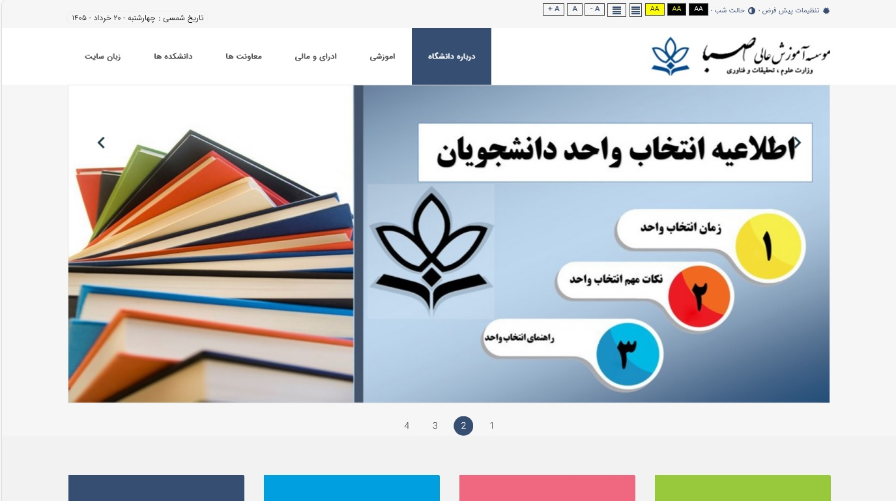

# Hamed Abbasi — Web Developer & IT Specialist

📍 Urmia, Iran  
📧 hamed.abbasy@gmail.com  
🎂 1986

---

## About Me

Web developer with 5+ years of experience in IT support and web development.  
PhD candidate in Software Engineering with hands-on experience in university IT infrastructure.  
Based in Urmia, Iran — open to remote opportunities.

---

## Skills

- Web Development: WordPress (theme customization, plugins, WooCommerce), Joomla, HTML, CSS  
- Programming: C# (academic level), basics of software engineering  
- Networking: Network+ level — troubleshooting, configuration, basic network administration  
- Hardware: PC assembly, hardware troubleshooting, diagnosing hardware failures  
- Software & OS: Windows user & administration, software installation, Microsoft Office (Word, Excel, PowerPoint, Outlook) — usage & training  
- Design: Adobe Photoshop (UI design, banners, web graphics)  
- IT Support: Helpdesk, troubleshooting, system administration, university IT infrastructure

---

## What I Can Do For You

- Build and customize professional WordPress websites  
- Design high‑quality graphics and UI with Photoshop  
- Fix WordPress issues, bugs, and performance problems  
- Migrate websites to WordPress or Joomla  
- Provide IT support, network troubleshooting, and system maintenance  
- Assemble PC hardware and diagnose hardware failures  
- Train users on Microsoft Office and Windows usage  
- Install and configure software and operating systems

---
##Portfolio
- **saba.ac.ir** -Developed an maintained the official website of Saba Institutet, Urmia. Iran
- 

## Professional Experience

IT Specialist & Web Developer  
*Urmia University* | 2021 – Present  

- Managing university IT infrastructure, helpdesk, and network support (Network+ level)  
- Developing and maintaining WordPress‑based internal tools  
- Supporting faculty and staff with technical, network, and hardware issues  
- PC assembly, hardware troubleshooting, and Windows/software installation  
- Providing Microsoft Office training to staff

---

## Education

PhD in Software Engineering (In Progress)  
Islamic Azad University, Urmia Branch

---

## Languages

- Persian: Native (Excellent)  
- Azerbaijani (Azeri): Native / Fluent  
- Turkish: Fluent  
- English: Intermediate

---

## GitHub Profile

> Check my repositories for web development, WordPress solutions, networking tools, and software engineering research

